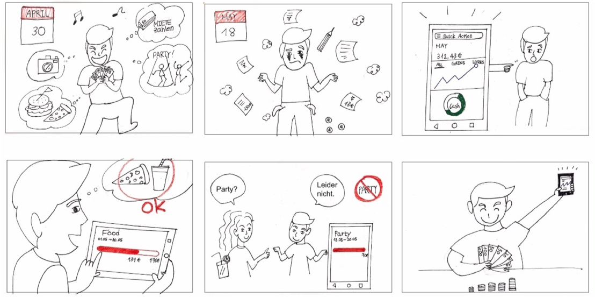
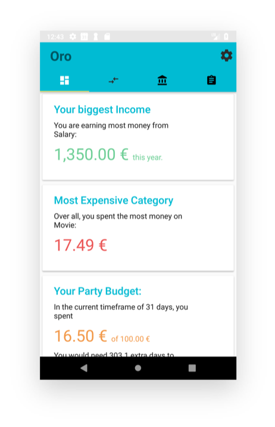
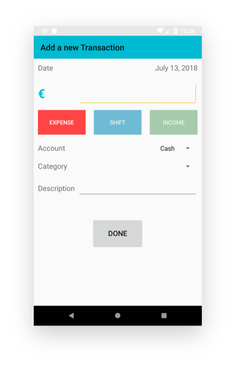
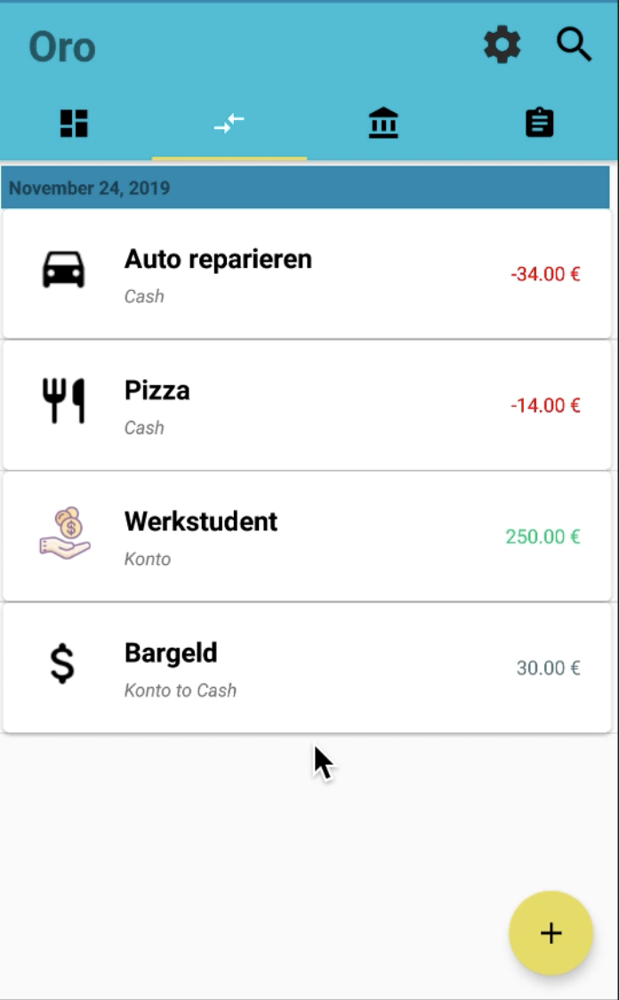
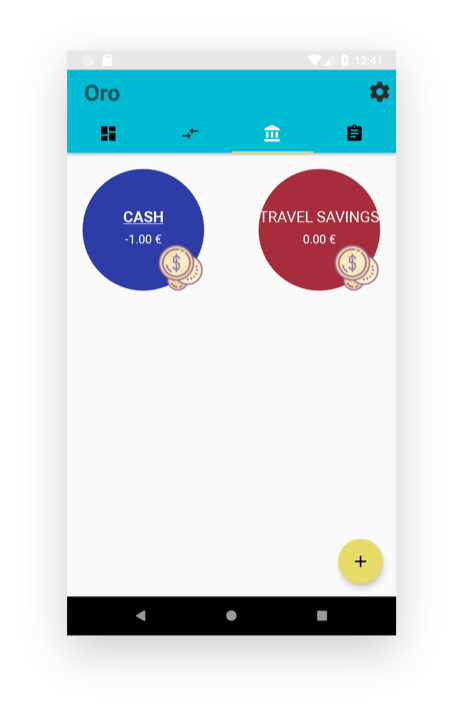
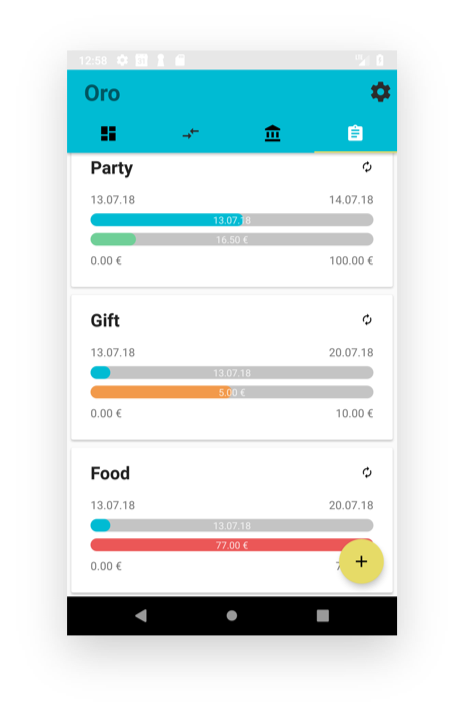

#  ORO- Android App
Praktikum Entwicklung von Mediensystemen mit Android (SS2018)

 

## App Name: ORO
Die Finanzen immer im Blick

 
 
## Das Szenario

 

 

## Die Idee
### Eine App zur Verwaltung der eigenen Finanzen.
:arrow_right: **Verwaltung verschiedener Konten** 
 Finanzen an unterschiedlichen Quellen - getrennt sortiert, gemeinsam verwaltet.

:arrow_right: **Eingabe von Einnahmen, Ausgaben und Transaktionen** 
 Einfaches Aufnehmen aller Transaktionen

:arrow_right: **Zusammenfassung aller Daten**
  Nie wieder den Überblick verlieren

:arrow_right: **Festlegen von “Budgets” für Zeiträume**
  Die volle Kontrolle über alle Ausgaben
 
 

# Feature

## :pushpin:Dashboard 

    

* **Ein schneller Überblick**
 Die wichtigsten Informationen werden dynamisch zusammengefasst.
* **Wächst mit dir**
 Je mehr du Oro nutzt, desto genauere und bessere Informationen wird es dir liefern.
* **Immer aktuell**
 Egal wie oft du deine Entscheidungen änderst, das Dashboard ist immer auf dem neuesten Stand!
          

## :pushpin:Transaction

* **Ein schneller Überblick**
 Die wichtigsten Informationen werden dynamisch zusammengefasst.

* **Transaktionen hinzufügen,  ändern und filtern**
 über eigenen Screen, beim Klick auf Done werden Eingaben validiert und ggf. eine neue Transaktion erstellt oder eine vorhandene aktualisiert. Alle Anzeigen aktualisieren sich in Echtzeit

* **Einnahmen, Ausgaben und Transfers zwischen Konten**
 stehen mit eigenen Parametern zur Auswahl

 

      

## :pushpin:Accounts
 
    

* **Accounts verwalten**
 Accounts haben Namen, Betrag, Farbe und Default-Status, einstellbar beim Erstellen und Ändern eines Accounts
* **Geld zwischen Accounts verschieben**
 durch Drag & Drop des Geld-Icons
           

## :pushpin:Budgets
 
    

* **Die wichtigsten Ausgaben**
 Welche Kategorien sind dir wichtig?
* **Wie viel gibst du aus?**
 Einfaches Festlegen eines Maximalbetrags
* **Für was gibst du es aus?**
 Nur Ausgaben der Kategorie werden berücksichtigt.
* **In welchem Zeitraum?**
 Budgets können sich automatisch erneuern, für die volle Kontrolle jederzeit.

